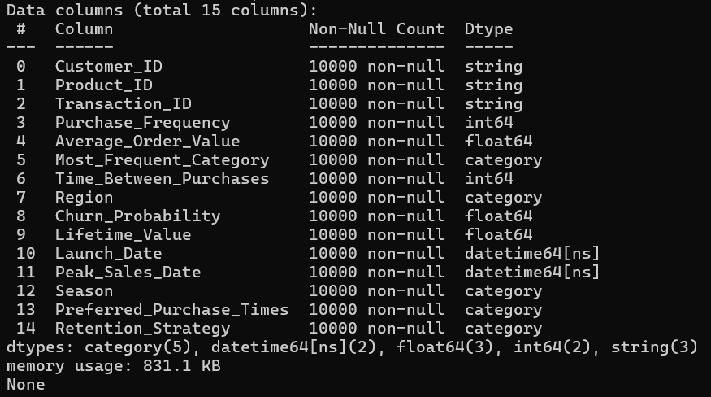

# DE

## Описание

Цели проекта:
	- провести работу над данными;  
	- выяснить, какие стратегии удержания применяются к разным типам клиентов и насколько логично 	  их использование с точки зрения бизнеса;  
	- получить знания и опыт в области инжиниринга данными (Data Engineering).

Разработка программ работы с базой данных ведется на языке Python. 

## Этапы проекта

	- Создание репозитория проекта и поиск dataset;
	- Выгрузка Dataset c Google Drive c помощью `data_loader.py` и настройка окружения;  
	- Выполнение приведения типов над dataset и сохранение его в формате `.parquet`.
	- Проведение EDA над dataset, используя технологию jupiter notebook.
	- Работа с базами данных SQLite и PostgreSQL.
	- Добавление визуализации в `EDA.ipynb`.
	- Создание `ETL` пайплайна.

##  Cсылки на dataset

Прямая ссылка на dataset - https://www.kaggle.com/datasets/imranalishahh/sales-and-customer-insights 
Ссылка на сохраненный dataset - https://drive.google.com/file/d/1j7ZAFLYStESJoCrkH0-bLctoxV75djUf/view?usp=sharing

##  Выгрузка Dataset c Google Drive c помощью data_loader.py и настройка окружения

## Установка Conda+Poetry, создание переменного окружения
  > [!IMPORTANT]
  > Для работы со скриптом, необходимо скачать и поместить в пустую папку 3 файла: environment.yml, pyproject.toml и poetry.lock, установить miniconda (убедитесь, что есть в PATH) и poetry. Выполнить шаги 2 и 7

1. Создать переменное окружение
```
cоnda env create -f environment.yml
```
2. Активировать переменное окружение
```
cоnda activate <название окружения из environment.yml>
```
3. Инициализировать Poetry
```
poetry init
```
4. Определить Poetry в виртуальное окружение Сonda
```
poetry config virtualenvs.create false
```
5. Добавить зависимости в проект
```
poetry add jupyterlab pandas matplotlib wget
```
6. Установить Poetry
```
poetry install
```
> [!TIP]
> При работе в VSCode необходимо выбрать переменное окружение через "Python: Select Interpreter"

# Приведение типов данных и сохранение датасета в формате .parquet.

Приведение типов данных выполняется с помощью
```
python3 data_loader.py
```
 Результат работы скрипта:


## EDA
Разведочный анализ данных и выводы по нему представлены в папке notebooks в файле [EDA.ipynb](./notebooks/EDA.ipynb).